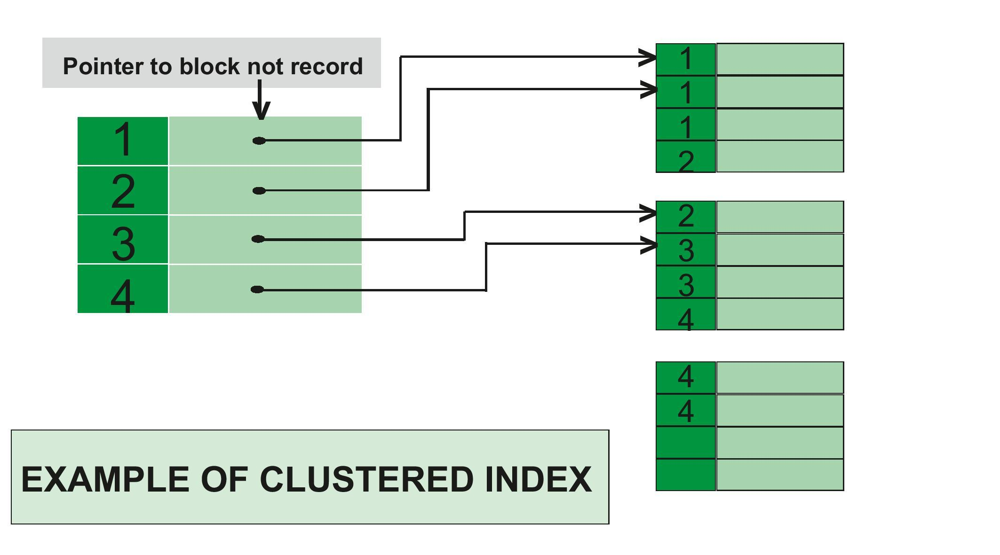
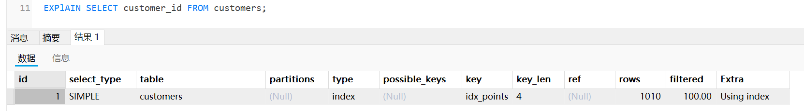

> 视频资料 [Mysql](https://www.bilibili.com/video/BV1UE41147KC)

# TODO 待 补 全

# 索引 - Index

## 基础语法

```sql

// 查看索引信息
SHOW INDEX IN table_name;

// 创建索引
CREATE INDEX index_name ON table_name ( column, ... );

// 删除索引
DROP INDEX index_name ON table_name;
```

## 索引类型

- Clusters index (聚集索引 、聚簇索引)
  - A Clustered index is **a type of index in which table records are physically reordered to match the index**.
    - 即表记录（物理存储结构）和索引顺序相一致
    - 
  - 在 MySQL 的 InnoDB 存储引擎中，**主键索引是聚集索引**，且**每个表只能有一个聚集索引**（因为聚集索引的物理存储顺序与数据行的顺序一致，数据行只能有一种物理存储顺序）
- Non-Clustered Index / Secondary Index （辅助索引）
  - 与数据的物理存储顺序无关
  - **指针**：辅助索引存储索引列的值以及一个指向实际数据行的指针。**在 InnoDB 中，这个指针是主键值**。
  - 通常用于加速特定查询
  - 可以有多个*辅助索引* （可以在表的多个列或列的组合上创建多个辅助索引，以提高不同查询的性能）

## 常见误区和知识点

1. 为每一列建立索引：
   1. 浪费大量空间的
   2. 降低写入速度（需更新索引）
2. 主键索引

## 调优

使用 `EXPLAIN` 查看 SQL 语句执行状态，包括是否全表扫描，索引信息，检索记录数等等

Example:

```sql
EXPlAIN SELECT customer_id FROM customers;
```



[输出数据格式](https://dev.mysql.com/doc/refman/8.4/en/explain-output.html#explain-output-columns:~:text=Table%C2%A010.1%C2%A0EXPLAIN%20Output%20Columns)

| Column                                                                                     | JSON Name       | Meaning                      |
| ------------------------------------------------------------------------------------------ | --------------- | ---------------------------- |
| id                                                                                         | select_id       | SELECT 标识符                |
| select_type                                                                                | None            | SELECT 类型                  |
| table                                                                                      | table_name      | 输出行的表                   |
| partitions                                                                                 | partitions      | 匹配的分区                   |
| [**type**](https://dev.mysql.com/doc/refman/8.4/en/explain-output.html#explain-join-types) | **access_type** | **连接类型**                 |
| possible_keys                                                                              | possible_keys   | 可选择的索引                 |
| key                                                                                        | key             | 实际选择的索引               |
| key_len                                                                                    | key_length      | 选择的索引长度               |
| ref                                                                                        | ref             | 与索引比较的列               |
| rows                                                                                       | rows            | 估计将被检查的行数           |
| **filtered**                                                                               | **filtered**    | **按表条件过滤的行的百分比** |
| Extra                                                                                      | None            | 额外信息                     |

## 前缀索引 - prefix index

## 全文索引 - full-text index

现有 posts 表格表示博客，需求是实现一个类似 google 的搜索引擎

| 字段      | 字段类型                    |
| --------- | --------------------------- |
| `post_id` | int NOT NULL AUTO_INCREMENT |
| `title`   | varchar NOT NULL            |
| `body`    | text NOT NULL               |

BAD MODE

```sql
SELECT * FROM posts
  WHERE title LIKE '%react redux%' OR
        body LIKE '%react redux%'
```

1. **全表扫描**性能差，即使使用`prefix index` 也解决不了问题，因为关键字可能在中间或者尾部
2. 关键字 `react` 和 `redux` 的相关性：
   1. 必须同时包含两个关键字，而**搜索引擎会返回模糊结果**（例如只包含一个关键字）
   2. **剔除部分不需要的结果**

GOOD MODE

```sql
CREATE FULLTEXT INDEX idx_title_body ON posts ( title, body );

SELECT
  *,
  // MATCH 参数必须和索引相对应（不可缺少一部分），实测8.0不需要保证顺序
  MATCH ( title, body ) AGAINST ( 'react redux' ) AS '相关性'
FROM
  posts p
WHERE
  MATCH ( title, body ) AGAINST ('react redux')
```

### 全文索引模式

- 自然语言模式：

  - 不支持布尔操作符（如 `+`, `-` 等）
  - 相关性得分会自动计算，**并根据得分排序结果**
  - 忽略某些常见词（称为“停用词”），如 "the", "and" 等

- 布尔模式

  - 布尔操作符：

    - `+`：词**必须存在**。例如，`+required` 表示结果中必须包含 `required`。
    - `-`：词**不能存在**。例如，`-term` 表示结果中不能包含 `term`。
    - `>` 和 `<`：提升或降低词的重要性。
    - `*`：词的结尾。例如，`run*` 可以匹配 `running`、`runs` 等。
    - `"`：短语搜索。例如，`"exact phrase"` 表示结果中必须包含 `exact phrase`。

    **特点**：

    - 支持复杂的布尔逻辑查询。
    - **不计算相关性得分，除非明确指定**。
    - 停用词仍然会被忽略。

  ```sql
  SELECT * FROM posts p
  WHERE
    MATCH ( title, body ) AGAINST ('optional -exclude +include "exact phrase"' IN BOOLEAN MODE)
  ```

## 复合索引 （_composite indexes_ / Multiple-Column Indexes）

```sql
SELECT * FROM customers
  WHERE state = 'CA' AND points > 1000;
```

直接在 `state` 或者 `points` 上建立索引可能存在问题：

- `state =  'CA'` 的用户量很大（例如百万级别），那么检索 `points` 就必须扫描所有 'CA' 的用户

使用复合索引解决

```sql

CRATE INDEX idx_state_points ON customers (state, points)
```

注意：⚠ 复合索引的列顺序很重要，规则如下：

- 将**最频繁使用**的列排在**最前面**

  - EXAMPLE：如果你有 5 个查询，大多数或全部的查询都按“州“查找顾客，那么“州”就应该放在最前面

- 将**基数较高**的列放在前面 （**不绝对正确**）

  - 基数：索引中**唯一值的数量**

  - 例如性别（抛开什么 LGBT），Male 和 Femal，那么他就可以把搜索范围从譬如 100w 全表缩减到 50w（均匀分布），

    那假设以 `state` 州 为例，同样均匀分布，就可以把搜索范围从 100w 缩减到 100w / 州数量

- 根据 SQL 估量索引性能，正如上面第二点是不绝对的，你无法创建一个能加速所有查询的复合索引
