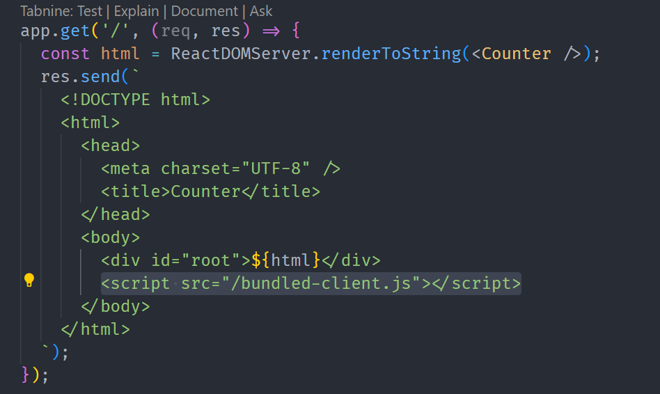

# SSR DEMO

> 参考 https://github.com/handyman-rk/ssr/tree/master

运行

1. `npm run build` 构建项目
2. `npm run start` 启动 Node 服务器

[`hydrateRoot`](https://react.dev/reference/react-dom/client/hydrateRoot)
Call `hydrateRoot` to “**attach**” React to existing HTML that was already rendered by React in a server environment.

核心流程

1. node 服务器通过 `RenderToString` 或 `renderToPipeableStream` 方法将组件渲染成字符串/流的形式，直接返回前端
   1. 只返回 `HTML`，那么前端肯定是么有交互的，这也是为什么需要做 `hydration`
   2. 从代码角度来说也就是说返回的 `HTML` 需要引入脚本
   
      
   
      > 此处需要引入打包后的脚本，因为浏览器不支持 JSX

2. `bundle-client.js` 也就是原 `src/client/client.js` 调用 `hydrateRoot` 进行水合并
