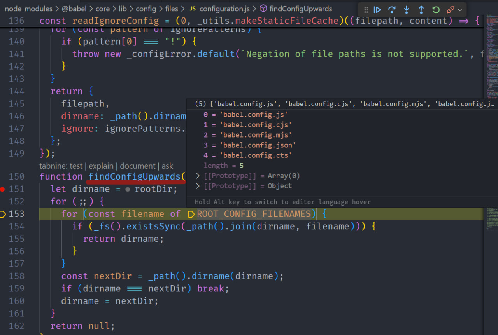

# 知识点

## 内部流程基本分为三步

1. 解析 （词法分析 + 语法分析 => AST)
   基于 `@babel/parse` （原 `Babylon` forked from `Acorn`）转换
2. 转换 (AST 转换) => `@babel/traversal` (based on 访问者模式（visitor）)
3. 生成 （基于 AST 使用 DFS 生成源码） => `@babel/generator`

## Presets 优先级高于 Plugins

先调用 Presets 后调用 Plugins
Presets 为[逆序调用]()，Plugins 为顺序

## Mono 相关

### Root `babel.config.json file`

在项目根目录创建 `babel.config.json`

> You can often place **all of your repo configuration in the root babel.config.json**. With `overrides`, you can easily specify configuration that only applies to certain subfolders of your repository, which can often be easier to follow than creating many `.babelrc.json` files across the repo.

<DEL>
个人理解通过 extends + overrides 在根目录创建不同的配置文件，例如针对不同场景：

> `babel.config.base.json`
>
> `babel.config.dev.json` 继承 base 做一定修改
>
> `babel.config.prod.json` 同上

而不是在项目中到处创建 `.babelrc.json` 作为覆盖

</DEL>

通过 `overrides` （`test`/`include`/`exclude`） 选项对不同目录配置不同设置

```JSON
{
  "presets": ["@babel/preset-env"],
  "overrides": [
    {
      "test": "src/legacy/**",
      "plugins": ["legacy-plugin"]
    },
    {
      "test": "*.ts",
      "presets": ["@babel/preset-typescript"]
    }
  ]
}
```

#### <span id="upward">Scenario：创建了 babel.config.json ，但在单独的包中运行 Babel</span>

例如

```shell
cd packages/some-package;
babel src -d dist
```

Babel 在该上下文中使用的 [root](https://babeljs.io/docs/options#root) **不是**的 monorepo 根，并且它将无法找到 babel.config.json 文件。

> If all of your build scripts run relative to your repository root, things should already work, but if you are running your Babel compilation process from within a subpackage, you need to tell Babel where to look for the config

所有构建脚本都在 repo 根目录运行，那一切都 OK，但正如上例一样如果你从一个*子包*里运行脚本，那么你需要告诉 babel 如何寻找 config

> 使用 js 格式的配置文件 + `console.log` 即可测试文件是否为读取调用

这里需要通过配置 [`rootMode`](https://babeljs.io/docs/options#rootmode) 选项，例如:

```shell
babel --root-mode upward src -d lib
```

> 注：此场景下子包是没有 `babel` 配置文件的，因为 `root-mode` **Only allowed** in Babel's programmatic options，**即使有对应子包的配置文件，babel 也不会处理**

### Subpackage `.babelrc.json` files

> _Similar to the way `babel.config.json` files are required to be in the "root", `.babelrc.json` files must be in the **root package**, **by default**_. This means that, the same way the working directory affects `babel.config.json` loading, it also affects `.babelrc.json` loading.

与 `babel.config.json` 一样需要在*根目录*，**默认情况下**`.babelrc.json` 也需要在根包（root package）

举例来说：

```
package.json
babel.config.js
packages/
  mod/
    package.json
    .babelrc.json
    index.js
```

编译 `packages/mod/index.js` 文件不会加载 `packages/mod/.babelrc.json` ，因为这个 `.babelrc.json` 位于子包中，而不是根包中，解决方法：

> 注：这里的编译 `packages/mode/index.js` 指的是**在根包中编译**

```
babelrcRoots: [
  ".",
  "packages/*",
],
```

# 测试

## 测试 api.cache 相关 API

> api.cache-test.js

## API 形式调用

> index.js

## 配置化调用

`npm run transform`

> DEBUG=babel 输出内部 babel-traversal 日志

`src/index.js` -> `lib/index.js`

# 部分实现

## babel-registry

> babel-registry-test
> 在子包目录中运行 `npm run transform` 即可

`index-wrap.js`:

```javascript
require("@babel/register")({
  rootMode: "upward",
});
```

这里的 upward 不起效，因为 upward 逻辑是向上寻找对应文件，源码如下：

因为会在该目录（packages/babel-registry-test）找到对应的 `babel.config.js` ，所以 `upward` 不起效

> babel-registry-test 的 `babel.config.js` 若改为 `.babelrc.json` 会导致 upward 找到 mono root， `.babelrc.json` 同 [上面场景](#upward) 不会加载

依赖于 [pirates](https://github.com/danez/pirates) 劫持 require

基于 Module 类改造（Module 是 CJS 里 module 对象的类）
[The `Module` Object](https://nodejs.org/api/module.html#the-module-object)

> TODO 上述 `Module` API 文档并未给出详细实现，需要结合 Node 源码和 pirates 源码

# 参考文档

[babel-handbook](https://github.com/jamiebuilds/babel-handbook/tree/master/translations/zh-Hans)

[babel-type-definitions](https://github.com/babel/babel/tree/master/packages/babel-types/src/definitions)

[ast-spec](https://github.com/babel/babel/blob/master/packages/babel-parser/ast/spec.md)

[Best Practices For Plugin](https://github.com/jamiebuilds/babel-handbook/blob/master/translations/en/plugin-handbook.md#best-practices)
